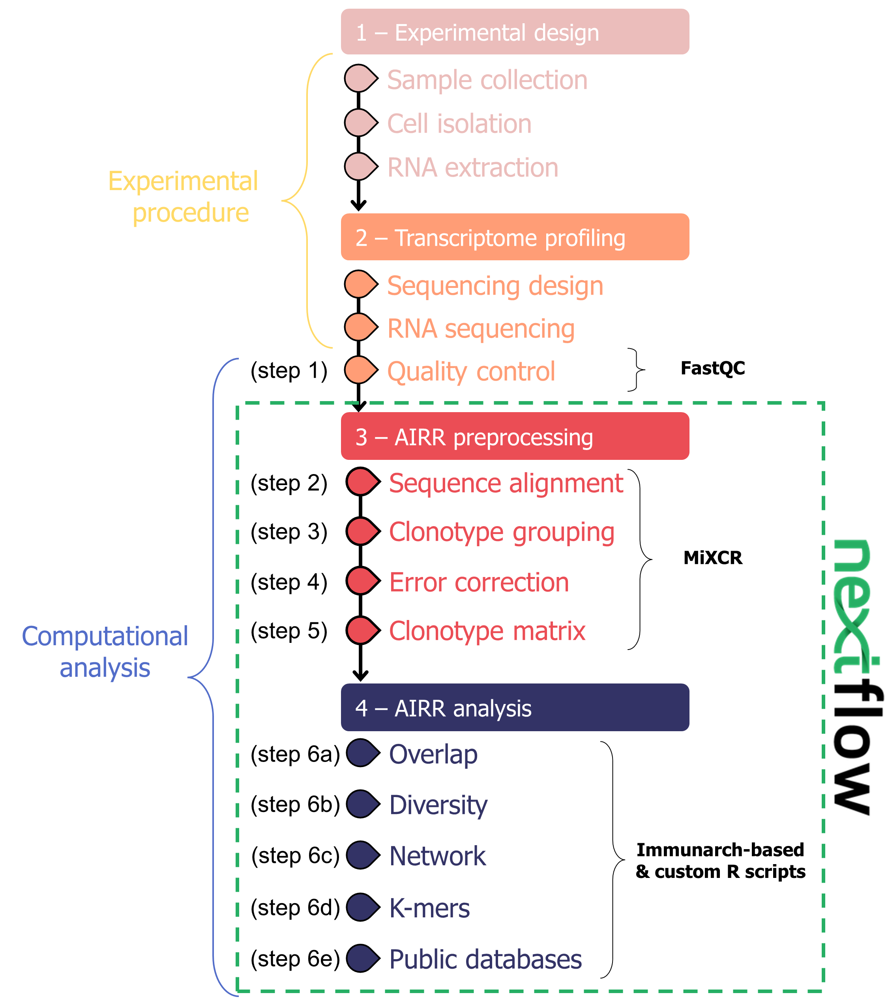
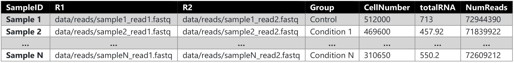

# TCR_nextflow

## Quick start
### Get the software
To pull the official MiXCR container
```
docker pull milaboratory/mixcr
```

To pull the container with the R dependencies needed to run this workflow:
```
docker pull ssnnm/mhecd4tcr:0.1.0
```

### Run the workflow
#### Local
Use the docker profile to use the containers with MiXCR and the R packages, and use cached results:
```
nextflow run nextflow_main.nf -profile docker -resume -work-dir work
```

#### Cluster (Slurm system)
If you want to use a specific path to save the singulartiy container, you need to export `NXF_SINGULARITY_CACHEDIR` before running the pipeline.
Then you run the pipeline specifying the profile you want to use for your cluster. The predefined profile are in the file `nextflow.config`.

Example commands:
```
export NXF_SINGULARITY_CACHEDIR=/path/to/my/singularity/images/
nextflow run nextflow_main.nf -profile singularity,slurm
```

## Introduction and overview
T-cell receptor (TCR) analysis is relevant for the study of immune system diseases and it is usually measured with targeted approaches where TCR genes are selectively amplified. However, many non-targeted RNA-seq experiments also contain TCR genes in a fraction of the data, reducing sample requirements and costs. Few studies have shown a step-by-step pipeline for the processing of immune repertoire data from whole transcriptome RNA-seq reads, representing a missed opportunity for complementing gene expression studies of immunological conditions with the analysis of the immune repertoire.

**Here we present a publicly available pipeline for the analysis of TCR repertoire profiles from bulk RNA-seq**. As case study, we use a dataset of CD4 T cells isolated from control patients, cirrhotic patients without and with Minimal Hepatic Encephalopathy (MHE). More information can be found in the paper called _"A Nextflow pipeline for CD4 T-cell repertoire reconstruction and analysis from RNA sequencing data"_ by Teresa Rubio, Maria Chernigovskaya, Susanna Marquez, Cristina Marti, Paula Izquierdo-Atarejos, Amparo Urios, Carmina Montoliu, Vicente Felipo, Ana Conesa, Victor Greiff and Sonia Tarazona. This repository contains the instruction to reproduce the results of the paper.

The step-by-step pipeline for the processing of immune repertoire data from whole transcriptome RNA-seq reads is summarized in the following figure:



The pipeline consists of four main steps representing both the experimental procedure and the computational analysis steps: 

1.  Experimental design, 
2.  Transcriptome profiling, 
3.  AIRR (Adaptive Immune Receptor Repertoire) preprocessing, and 
4.  AIRR analysis. 

The _experimental procedure_ includes sample collection, immune cell isolation, RNA extraction, sequencing design (e.g., library strand specificity, paired- or single-end reads), and RNA sequencing (RNA-seq). The _computational analysis_ starts with fastq files in which the sequencing quality (_**step 1**_) needs to be verified. MiXCR software was used to assemble TCR repertoires from sequencing reads after quality control. We chose this well-established repertoire reconstruction tool because it is able to extract high-frequency clonotypes from RNA-seq data with a comparable yield to other similar tools. MiXCR assembly algorithm avoids the introduction of false-positive clones, which might appear either by alignment of reads to non-target molecules or by overlapping between two sequences from different clones in the reconstruction of partially covered CDR3 regions. The MiXCR repertoire extraction software was performed using the "analyze shotgun" command which consists of the following steps: the workflow starts with sequence alignment against reference V, D, J, and C genes (_**step 2**_), followed by clustering of identical sequences into clonotypes (default, clustering by CDR3β) (_**step 3**_) and correction of PCR/sequencing errors (_**step 4**_) to output a tab-delimited file containing the quantification as a clonotype matrix (_**step 5**_).

Additional AIRR analysis steps are needed to study different immune receptor features: overlap for clonal convergence (_**step 6a**_), diversity indexes for clonal expansion (_**step 6b**_), network analysis for clonal sequence architecture (_**step 6c**_), k-mer distribution for repertoire sequence similarity (_**step 6d**_) and public databases screening for antigen specificity (_**step 6e**_). We decided to focus on the _T-cell receptor beta chain (TRB)_ for all subsequent analyses. TRB is more appropriate than TRA for identifying T-cell clones because around 7-30% of T cells can have two different alpha chains expressed on the same clone while only 1% of T cells can have two different beta chains on the same clone.


## Workflow Steps and accompanying scripts
### Workflow Overview
|Workflow Step                                         | Script                                    | 
|:---------------------------------------------------  |:----------------------------------------- |
|1 - Alignment assembly quality control                | `01_mixcr_qc.Rmd`                         |
|2 - Clonotype filtering                               | `02_datafiltering.Rmd`                    |
|3 - T-cell repertoire (TCR) statistics                | `03_dataset_overview.Rmd`                 |
|4 - Repertoire correlation plots                      | `04_correlations.Rmd`                     |
|5 - Overlap (Clonal convergence)                      | `05_overlap.Rmd`                          |
|6 - Diversity (Clonal expansion)                      | `06_diversity.Rmd`                        | 
|7 - K-mers (Repertoire similarity)                    | `07_kmers.Rmd`                            |
|8 - Network (Clonal architecture)                     | `08_network.Rmd`                          |
|9 - Databases (Antigen specificity)                   | `09_ddbb.Rmd`                             |
|10 - Final report (bookdown)                          | `10_report.Rmd`                           |

### Instructions
The Nextflow pipeline is composed by the files:
- _'main.nf'_ &rarr; main workflow
- _'processes.nf'_ &rarr; implemented processes that internally runs MiXCR for read alignment/clone assamble and the 10 Rmarkdown scripts to perform the TCR analysis
- _'config.nf'_ &rarr; you can edit this file to expand the given profiles (standard, docker, singularity, slurm) or to provide your own input parameters:
   - readfiles    = "sampleslist.csv"
   - project_name = "TCR_MHE_PROJECT"
   - chain        = 'TRB' //chain should be one of 'TRA' or 'TRB'
   - mcpas        = "data/ddbb/McPAS-TCR.csv"
   - vdjdb        = "data/ddbb/VDJdb-TCR.tsv"
   - specie       = 'HomoSapiens' //specie should be one of 'HomoSapiens' or 'MusMusculus'
   - outdir       = 'results'

One 'readsfile' in .csv format (e.g., _'samplesinfo.csv'_) is required as input containing metadata information. The following columns are mandatory (if any of the required fields are not available, you must provide a vector of zeros):



The Nextflow pipeline is able to use RNA-seq data from 2 species ('HomoSapiens' or 'MusMusculus') as input and quantify clonotypes for both TRA (alpha) and TRB (beta) chains of the TCR. You can chose one of the two chains to define the "clones" in your analysis or you also can launch twice the Nextflow pipeline changing the "chain" parameter to obtain both results.

All the results are collected inside a the 'outdir' (e.g., _'results/'_). The Rmarkdown scripts generate ready-to-publish plots and tables that are saved in the folder _'results/TCRanalysis_bookdown'_. A final report (e.g., _'results/final-report.html'_), that collects all the results together, is also generated with short explanations about each output plot/table. Finally, you have to specify the path to the folder that contains McPAS-TRB and VDJdb-TRB databases (e.g., _'data/ddbb/McPAS-TCR.csv'_). At the moment of download, McPAS-TCR and VDJdb databases had been last updated on 6 March 2021 and 2 February 2021, respectively. You can provide new versions of the databases in .csv formats when available (http://friedmanlab.weizmann.ac.il/McPAS-TCR/ and https://vdjdb.cdr3.net/).


## Necessary software for TCR analysis 
Before starting the TCR Workflow analysis, make sure to have installed:
- Nextflow (https://www.nextflow.io/docs/latest/getstarted.html)

And one of the following containers depending if you run the workflow locally or in a cluster, respectively:
- Docker (https://docs.docker.com/get-docker/)
- Singularity (https://sylabs.io/guides/3.0/user-guide/installation.html)


Now you are ready to start the TCR analysis!
